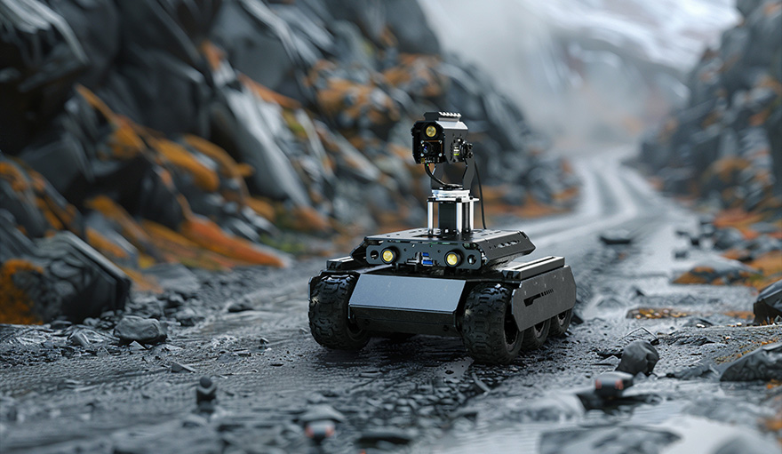

# UGV Beast Control (latent_scalers)

Raspberry Pi control app for a Waveshare **UGV Beast** rover — a fork of
Waveshare's [`ugv_rpi`](https://github.com/waveshareteam/ugv_rpi), running
on the rover's onboard Pi and driving the ESP32-based lower-computer
controller over UART/JSON.

## What's here

This is the actual upper-computer app running on the physical rover, plus
one addition on top of upstream:

- **Reactor X2** (`templates/reactor.html`, `reactor_service.py`) — a
  second control page with a split live/processed video view, real
  WASD + drive control, a combined light toggle (both lights beside the
  depth camera), presets, client-side screenshot/recording, and a
  reference-image upload. The video-effects backend is currently a mock
  passthrough (`reactor_service.py`), swappable for a real API later.

Everything else — Flask + Socket.IO app (`app.py`), motor/servo/light
control (`base_ctrl.py`), computer vision (`cv_ctrl.py`), audio
(`audio_ctrl.py`), and the JupyterLab tutorials — is upstream Waveshare
code for driving the rover, controlling its pan-tilt camera and lights,
and running CV features (object/face/gesture recognition, line tracking,
motion detection).

## Basic architecture

The Pi (upper computer) handles AI vision, the web UI, and strategy
planning; an ESP32-based driver (lower computer, [`ugv_base_general`](https://github.com/waveshareteam/ugv_base_general))
handles motion control and sensor data. They talk over GPIO UART using
JSON commands.

## Running it

Already installed on the rover's SD card. To set up on a fresh Pi:

    git clone https://github.com/Greninja44/latent_scalers.git
    cd latent_scalers
    sudo chmod +x setup.sh autorun.sh
    sudo ./setup.sh
    ./autorun.sh
    sudo reboot

After boot, the OLED shows the Pi's IP; the web UI is at `[IP]:5000`
(`/reactor.html` for the Reactor X2 page), JupyterLab at `[IP]:8888`. If
not on a known WiFi network, it hosts its own AP (`AccessPopup`,
password `1234567890`) at `192.168.50.5:5000`.

Robot type is set via `config.yaml` (or `s <NN>` over the command line —
first digit is robot type: `1` RaspRover, `2` UGV Rover, `3` UGV Beast;
second digit is the module: `0` none, `1` RoArm-M2, `2` Camera PT).

## License

Upstream `ugv_rpi` code: Copyright (C) 2024 [Waveshare](https://www.waveshare.com/),
GNU GPLv3 — see [LICENSE](./LICENSE). Modifications in this fork are
licensed the same way.
